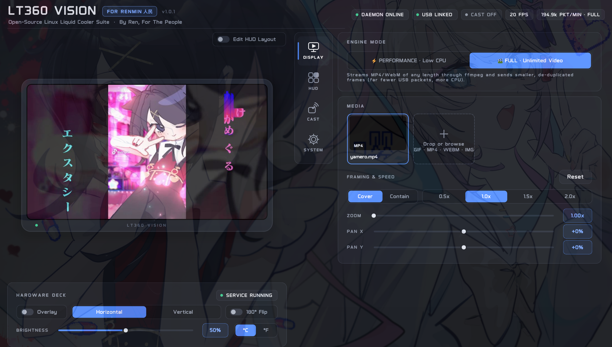

# deepcool-lt360




Linux driver, daemon, CLI and native GUI for the DeepCool LT360 VISION AIO cooler's
USB display (VID `3633`, PID `002e`), reverse-engineered in [`PROTOCOL.md`](PROTOCOL.md).
No official Linux support exists for this panel — this project drives it entirely
over `libusb`, no kernel module or vendor tooling required.

## Features

- Stream any static image, looping GIF or MP4/WebM video to the pump's 480×854 panel.
- Horizontal/vertical orientation and 180° mirror flip, brightness, °C/°F.
- **Media framing**: Cover/Contain fit, 1.0–2.5× zoom, pan X/Y to put any
  character of a wide or tall clip in frame, and 0.5×–2.0× playback speed.
- Live CPU/GPU telemetry overlay (temp, load, clock, time) in three built-in
  themes, composited on top of your media in real time at <2% CPU overhead.
- A fully custom, hot-reloading HUD (`customize.json`) with text, bars, lines,
  **arc/ring gauges**, **rolling 60-second sparkline graphs** and **PNG
  stickers**, plus your own shell/sysfs telemetry.
- A **visual HUD editor**: drag elements around on the live preview and tweak
  position, size, color and text from an inline inspector.
- A background daemon (`lt360d`) that reconnects automatically if the device
  is unplugged, plus a scriptable CLI (`lt360ctl`) and a native dark-themed
  GUI (`lt360-gui`) with a live mirror of what's on the pump screen, a
  **system tray** mode, and a **Waybar** module (`lt360ctl status --waybar`).

### New in v0.3.0

| | |
|---|---|
| `ring`, `sparkline`, `image` widgets | Arc gauges with glow, 60 s rolling graphs of any numeric sensor, alpha-PNG badges. Two new presets: `dual_rings_hud`, `sparkline_pro`. |
| Visual HUD Editor | **Edit HUD Layout** on the pump preview (CUSTOM HUD theme): click to select, drag or arrow-key to move, inspector for X/Y, size, color (`QColorDialog`) and text. Saves straight to `customize.json`. |
| Media Framing & Speed | Fit (`Cover`/`Contain`), zoom, pan X/Y and playback speed in the GUI Media card, `lt360ctl framing`, and `config.json` → `"framing"`. |
| Hardware Deck | Overlay, orientation, 180° flip, °C/°F, brightness and daemon Restart/Autostart always on screen under the preview. |
| System tray | `lt360-gui --tray` / `--minimized`, close-to-tray, and a tray menu for themes, HUD presets, engine mode and brightness. |
| Waybar | `lt360ctl status --waybar` prints one line of Waybar JSON. |
| Fixes | Readout bars never repeat a metric (old `TIME CPU CPU` configs become `TIME CPU GPU`); `Load Preset...` no longer renders as `Load Preset.`; theme-card previews shrink text to fit instead of overlapping. |

## Components

| File | Purpose |
|---|---|
| `src/lt360d.py` | Background daemon. Streams media to the panel, runs the sensor poll + overlay compositor, and listens on a Unix socket (`$XDG_RUNTIME_DIR/lt360.sock`, mode 0600) for commands. |
| `src/lt360ctl.py` | Scriptable CLI to control the running daemon. |
| `src/lt360_gui.py` | Native PyQt6 desktop app — live preview, media picker + framing, Hardware Deck, overlay controls, visual HUD editor, system tray. |
| `src/lt360_widgets.py` | The GUI's custom-painted widgets (pump stage, neon sliders/toggles, theme cards). |
| `src/lt360_sensors.py` | CPU (`psutil`/`k10temp`/`zenpower`/`coretemp`) and GPU (`amdgpu` hwmon or `nvidia-smi`) telemetry reader. |
| `src/lt360_overlay.py` | Themed overlay compositor (Pillow + the bundled DeepCool fonts). |
| `src/lt360_custom.py` | `customize.json` engine: hot reload, custom sensors, 60 s telemetry history, all widget renderers. |
| `src/lt360_common.py`, `src/lt360_media.py` | Wire protocol encoding, media framing, GIF/image pre-rendering and ffmpeg video streaming. |
| `default_config.json` | Media/brightness/mode/overlay loaded by the daemon on startup. |
| `systemd/deepcool-lt360.service` | User service unit. |
| `udev/99-deepcool-lt360.rules` | Lets the daemon open the device without root. |
| `desktop/` | `.desktop` launcher entry and app icon. |
| `packaging/PKGBUILD` | Arch Linux / AUR package. |

## Hardware compatibility

Tested against the **DeepCool LT360 VISION** (`lsusb` name `DC LT360 VISION`,
VID:PID `3633:002e`). The device exposes one vendor-specific USB interface
with four bulk endpoints — no HID interface, no kernel driver binds to it, so
it must be driven via `libusb`/`pyusb`, which is what this project does. Other
DeepCool "VISION" panels sharing this protocol family may work but are
untested; see `PROTOCOL.md` for the full reverse-engineering notes if you want
to check your own device against them.

## Install

### Arch Linux / AUR

```sh
git clone https://github.com/hereisren/deepcool-lt360-driver.git
cd deepcool-lt360-driver/packaging
makepkg -si
```

This installs system-wide (`/usr`), including the udev rule, systemd user
unit, and desktop launcher. Enable the service with:

```sh
systemctl --user enable --now deepcool-lt360.service
```

### Any other distro

```sh
git clone https://github.com/hereisren/deepcool-lt360-driver.git
cd deepcool-lt360-driver
./install.sh
```

This creates a venv under `~/.local/share/deepcool-lt360`, installs the
daemon/CLI/GUI into it, installs the udev rule (asks for `sudo` once), copies
the systemd user unit and enables it, and installs a desktop launcher +
icon so **LT360 VISION — For Renmin** shows up in your app menu. Safe to re-run.

## Usage

### GUI

```sh
lt360-gui
```

or launch **LT360 VISION — For Renmin** from your app menu / rofi / wofi. The GUI
shows a live mirror of the pump screen, lets you pick and frame media, configure
the telemetry overlay, and edit your custom HUD visually.

- **Hardware Deck** (under the preview, always visible): Overlay on/off,
  Horizontal/Vertical, 180° Flip, brightness slider with live `%` badge, °C/°F,
  and the daemon service's Restart, Start/Stop and Autostart controls.
- **Media → Framing & Speed**: `Cover`/`Contain`, zoom 1.00–2.50×, pan X/Y
  −100 %…+100 % (e.g. slide a wide GIF to keep a character centered) and
  0.5×/1.0×/1.5×/2.0× playback. Changes re-render the media within a moment.
- **Edit HUD Layout** (top-right of the preview, CUSTOM HUD theme only): see
  [Visual HUD editor](#visual-hud-editor).
- **System tray**: `lt360-gui --tray` starts hidden in the tray (closing the
  window keeps it there); `--minimized` starts minimized. The tray menu has
  Show/Hide, overlay theme, HUD presets, engine mode, brightness, a
  **Close to Tray** toggle (remembered in `~/.config/deepcool-lt360/gui.json`)
  and Quit. To start it with your session on Hyprland:
  `exec-once = lt360-gui --tray`.

### CLI

```sh
lt360ctl media ~/Pictures/loop.gif
lt360ctl brightness 75
lt360ctl mode horizontal
lt360ctl mirror on
lt360ctl celsius on

# telemetry overlay
lt360ctl overlay on --theme codezero --primary cpu_temp --secondary gpu_temp,cpu_load,time
lt360ctl overlay off

# media framing (pan is a percentage: -100 = left/top edge, 0 = centered, 100 = right/bottom edge)
lt360ctl framing --fit cover --zoom 1.6 --pan-x -35 --pan-y 0
lt360ctl framing --fit contain
lt360ctl framing --speed 1.5
lt360ctl framing --reset

lt360ctl preview ./snapshot.jpg   # save the exact frame currently on the panel
lt360ctl status
lt360ctl status --waybar          # one-line JSON for Waybar
lt360ctl --version
```

Overlay themes: `boundary` (red), `codezero` (cyan/blue), `pixelworld`
(purple — great for RGB builds), `custom` (your own `customize.json`, below).
Metrics: `cpu_temp`, `gpu_temp`, `cpu_load`, `gpu_load`, `time`, `off`. A metric
is never shown twice: picking one that another slot already shows swaps the two.

Framing is stored in `config.json` as
`"framing": {"fit": "cover", "zoom": 1.0, "pan_x": 0.0, "pan_y": 0.0, "speed": 1.0}`
(`pan_x`/`pan_y` from −1.0 to 1.0, `speed` from 0.25 to 4.0). Speed changes the
frame timing of GIFs/images/performance-mode video without re-rendering them;
full-mode video is re-timed inside ffmpeg.

### Waybar

`lt360ctl status --waybar` always exits 0 and prints
`{"text", "alt", "class", "percentage", "tooltip"}`: the text is the CPU · GPU
temperature, the tooltip has load, USB link, FPS, engine, brightness, overlay and
media, and `class` is `normal`, `warm` (≥70 °C), `hot` (≥85 °C), `disconnected`
(daemon up, USB unplugged) or `offline` (daemon not running).

```jsonc
// ~/.config/waybar/config.jsonc
"custom/lt360": {
    "exec": "lt360ctl status --waybar",
    "return-type": "json",
    "interval": 3,
    "format": "❄ {}",
    "on-click": "lt360-gui"
}
```

```css
/* ~/.config/waybar/style.css */
#custom-lt360.warm { color: #facc15; }
#custom-lt360.hot { color: #f87171; }
#custom-lt360.offline, #custom-lt360.disconnected { color: #8b86a3; }
```

## Custom Overlays & Telemetry (`customize.json`)

`~/.config/deepcool-lt360/customize.json` lets you design your own overlay and
add your own telemetry without touching the driver's code. It is created from a
default on first run, and the daemon **hot-reloads it within a second of every
save**. A typo never blanks the screen: the error is logged
(`journalctl --user -u deepcool-lt360 -f`, shown in the GUI, and in
`lt360ctl status` under `custom.error`) and the last valid layout stays up.

```sh
lt360ctl customize --edit                       # print path, switch to the "custom" theme, open $EDITOR
lt360ctl customize --list                       # bundled presets
lt360ctl customize --preset renmin_cyberpunk    # copy a preset in (old file kept as customize.json.bak)
lt360ctl customize --reset                      # back to the default layout
```

In the GUI pick the **CUSTOM HUD** card, then **Open customize.json** or
**Load Preset...**. Presets live in `examples/overlays/` (`renmin_cyberpunk`,
`minimal_pills`, `now_playing_hud`, `full_telemetry_grid`, and new in v0.3.0
`dual_rings_hud` and `sparkline_pro`); copy-paste widgets from them into your
own file.

### Layout

```json
{
  "custom_sensors": { "...": "..." },
  "elements": [ { "type": "text", "...": "..." } ],
  "elements_vertical": [ "optional: used instead of elements when the panel is in vertical mode" ]
}
```

The canvas is **854×480** (horizontal) or **480×854** (vertical); `x`/`y` are
top-left pixel coordinates. Colors are `#RRGGBB` or `#RRGGBBAA` (AA = alpha, so
`#000000aa` is translucent black). Elements draw in list order. Keys starting
with `_` (e.g. `"_comment"`) are ignored, as are whole lines starting with `//`.

| type | keys |
|------|------|
| `rect` / `box` | `x y w h`, `fill`, `outline`, `radius`, `width` |
| `text` | `x y`, `text`, `font` (`pixel`, `sans`, `semibold`, `light`, `thin` or a `.ttf` path), `size`, `color`, `align` (`left`/`center`/`right`), `shadow`, `max_width` (truncates with …) |
| `bar` | `x y w h`, `source`, `min`, `max`, `fill`, `bg`, `outline`, `radius` |
| `line` | `x1 y1 x2 y2`, `color`, `width` |
| `ring` | `x y` (top-left of the gauge), `radius` (or `w`/`h`), `thickness` (8), `source`, `min` (0), `max` (100), `start_angle` (135), `end_angle` (405), `bg` (`#1a1625cc`), `fill` (`#a855f7`), `glow` (optional halo color), `cap` (`round`/`flat`), centered `text` + `size`, `font`, `color`, `shadow`, and a smaller `label` + `label_size`, `label_color`, `label_font` |
| `sparkline` | `x y w h`, `source`, `min` (0), `max` (100), `line_color` (`#22d3ee`), `fill_color` (`#22d3ee33`), `bg` (`#0a0a12aa`), `outline` (`#262038`), `radius` (8), `width` (line, 2), `grid` (optional guide-line color), `dot` (latest-sample dot, `true`) |
| `image` | `x y`, `path` (PNG/WebP/JPEG/GIF first frame; relative paths are relative to `~/.config/deepcool-lt360/`), `w`/`h` (both = stretch, one = keep aspect, none = natural size), `opacity` (0.0–1.0) |

`ring` angles are degrees clockwise from 3 o'clock, so the default 135 → 405 is
a 270° gauge open at the bottom; `0`/`360` is a full circle. `sparkline` plots
the last 60 seconds (one sample per second, newest at the right) of any numeric
built-in (`cpu_temp`, `gpu_temp`, `cpu_load`, `gpu_load`, `ram_percent`) or
numeric custom sensor; the daemon keeps that history even while another theme
is active, so graphs are full the moment you switch. `image` files are cached by
path + modification time: overwrite the PNG and the panel picks it up.

Text variables (`"CPU {cpu_temp}°{temp_unit} | {my_sensor}"`): `cpu_temp`,
`gpu_temp` (in your °C/°F setting), `cpu_load`, `gpu_load`, `cpu_freq` (MHz),
`cpu_freq_ghz`, `gpu_power` / `gpu_wattage` (W), `gpu_power_str` / `gpu_wattage_str`
(e.g. `85W`), `gpu_clock`, `ram_percent`, `ram_used`, `ram_total` (GB), `time`, `date`,
`temp_unit`, plus every custom sensor. On machines with both an integrated and a discrete
AMD GPU, all GPU values come from the discrete card (the one with the most dedicated VRAM),
so there is no need for hand-written `/sys/class/hwmon` sensors.
Unavailable readings show `N/A`. A bar's `source` is any of the numeric ones
above or a custom sensor (temperatures are in °C for bars).

### Custom sensors

```json
"custom_sensors": {
  "nvme_temp": { "type": "sysfs", "path": "/sys/class/hwmon/hwmon1/temp1_input",
                 "scale": 0.001, "unit": "°C" },
  "now_playing": { "type": "command",
                   "command": "playerctl metadata --format '{{artist}} - {{title}}'",
                   "interval_sec": 2.0, "timeout_sec": 1.5, "fallback": "Nothing playing" },
  "vram": { "type": "command", "command": "cat /sys/class/drm/card1/device/mem_info_vram_used",
            "scale": 9.5367e-7, "decimals": 1, "unit": "MB", "interval_sec": 2 }
}
```

- `sysfs` reads the first number in any `/sys` or `/proc` file, multiplied by `scale` (default 1).
- `command` runs through the shell every `interval_sec` (minimum 0.5) in its own
  thread, with a `timeout_sec` (max 3). The **first line** of stdout is the value;
  a non-zero exit, timeout or empty output shows `fallback` (default empty).
  Commands only run while the custom theme is on screen.
- With `scale` the output is treated as a number (`decimals` sets the precision);
  otherwise it is shown as text. `unit` is appended (`"GB"` gets a space, `"°C"` doesn't).
- Use it as `{name}` (with unit) or `{name_value}` (without), and as a bar `source`.
- Names must be identifiers and can't reuse a built-in name.

The commands run as you, from a file only you can edit; only paste layouts you trust.

### Visual HUD editor

With the **CUSTOM HUD** theme active, switch on **Edit HUD Layout** (top-right
corner of the pump preview). Every element's bounding box is outlined on the
live frame:

- **Click** an element to select it (the smallest box under the cursor wins, so
  a label can be picked off the panel behind it), **drag** to move it, or nudge
  it with the **arrow keys** (Shift = 10 px).
- The **inspector bar** under the preview edits `X`/`Y`, the size fields for
  that type (`SIZE` for text, `RADIUS`/`THICK` for rings, `W`/`H` for boxes,
  bars, sparklines and images, `WIDTH` for lines), the main **Color** (a color
  picker with alpha) and the `text` of text/ring elements.
- Changes are written straight to `customize.json` (throttled while dragging)
  and the daemon hot-reloads them, so the pump follows along. The first save of
  each editing session keeps the previous file as `customize.json.bak`. The
  editor rewrites the file in the presets' one-element-per-line style;
  `"_comment"` keys survive but whole-line `//` comments do not. If the file is
  changed in a text editor meanwhile, the GUI reloads it instead of overwriting.
- In vertical mode the editor edits `elements_vertical` when the file has it.

## Protocol overview

The panel is driven over two bulk endpoints on interface 0:

- `EP 0x04` (OUT) — short (48-byte) command packets: start streaming, and a
  settings packet (orientation, brightness, °C/°F).
- `EP 0x02` (OUT) — image data: each JPEG frame is chunked into 512-byte
  packets (`Start` header with length/checksum, `trans####` chunks,
  `DCLdfinish` trailer).

Frames are always encoded at the panel's native 480×854 portrait resolution;
horizontal/vertical "mode" and the mirror flag just control how far the
source image is rotated before encoding (`lt360_common.rotation_deg`). See
`PROTOCOL.md` for the full reverse-engineering log.

## Uninstall

```sh
systemctl --user disable --now deepcool-lt360.service
rm -rf ~/.local/share/deepcool-lt360 ~/.config/deepcool-lt360
rm -f ~/.local/bin/lt360d ~/.local/bin/lt360ctl ~/.local/bin/lt360-gui
rm -f ~/.local/share/applications/deepcool-lt360.desktop
rm -f ~/.local/share/icons/hicolor/scalable/apps/deepcool-lt360.svg
sudo rm -f /etc/udev/rules.d/99-deepcool-lt360.rules
```

## Fonts

`assets/fonts/` contains fonts extracted from the vendor software, included for hardware UI parity. They are not covered by this project's MIT license (see `assets/fonts/README.md`). If they are removed, the overlay automatically falls back to a system sans font (DejaVu/Liberation/Noto) or Pillow's built-in font.

## Development & Credits

Built by **Ren** ([@hereisren](https://github.com/hereisren)) — *For Renmin (人民), For The People*.

Developed through manual hardware reverse-engineering, live USB/LCD testing, and AI-assisted engineering using **Claude Opus 5.5**, **Gemini 3.1 Pro**, and **Claude Sonnet 5**.
